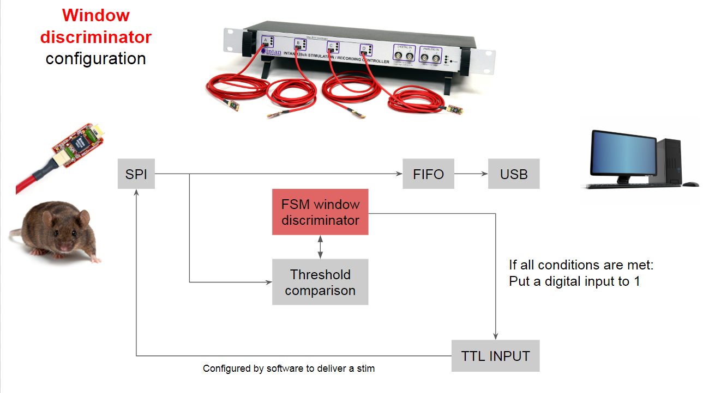

# Hardware

** Primarily Verilog code and synthesized/compiled output from the Xilinx ISE application. **

## Possible configurations
### Basic configuration:

### Window discriminator configuration:

### New possible configuration:
in progress...

