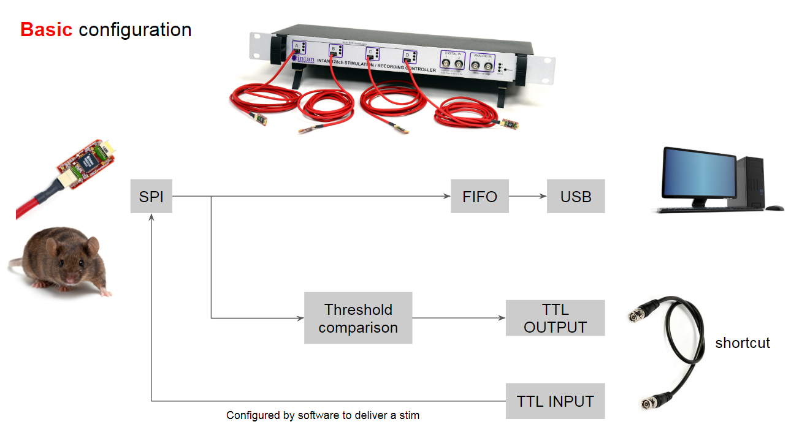
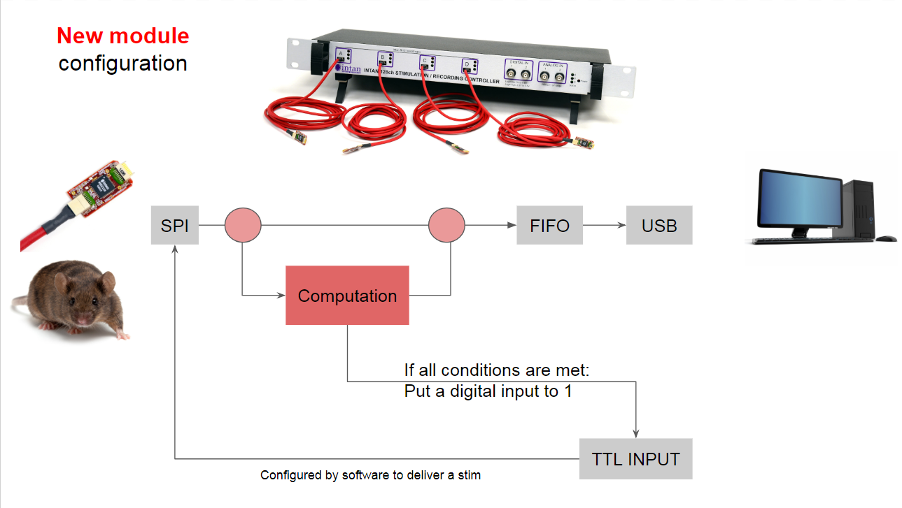

# Hardware #
**Primarily Verilog code and synthesized/compiled output from the Xilinx ISE application.**  

## Possible configurations

### Basic Intan ADS ###
  
_**Figure 1:** Activity Dependent Stimulation (ADS) using the Intan Stimulation Controller with no modifications to FPGA hardware or software. A monopolar threshold is set on a single DAC channel that is determined to contain adequate neural spiking activity. A BNC cable hooks the digital TTL output corresponding to thresholded output from that DAC channel to a digital TTL input. The TTL digital input channel is then set to trigger stimulation on the rising edge of the digital trigger with a fixed delay and blanking period after the stimulus delivery._

### Window State Machine ###
  
_**Figure 2:** ADS using the Intan Stimulation Controller with window discriminator option added to DAC via FPGA hardware and software interface modifications. For a single channel, multiple monopolar thresholds (up to 8) are set as "inclusion" or "exclusion" criteria for a state machine, for which all conditions must be true for the duration of each monopolar threshold level (e.g. a given threshold can be set to be maintained for the first two samples after a spike of sufficient amplitude is detected). All circuits are connected internally. Because the state machine runs through the DAC, multiple channels cannot trigger stimulation independently because the state machine "complete" output is routed to apparent "Digital Input 13" (because the lab didn't purchase the digital I/O expander and therefore didn't need that input). Stimulation is triggered at a fixed latency after Digital Input 13 achieves a high state, and a fixed blanking period during which Digital Input 13 cannot trigger stimulation is imposed._

### Future Directions ###
  
_**Figure 3:** Intan modifications designed to implement architecture more similar to a classical engineering control system. A computational module is implemented between the SPI and FIFO buffer, which does not necessarily need to involve the DAC in any way. Possible computations could include implementing [filters](https://github.com/StefanoBuccelli/intan_project#filter-updates), [state machines](https://github.com/StefanoBuccelli/intan_project#window-discriminator), or some sort of feedback control that depends on activity detected on many channels simultaneously._