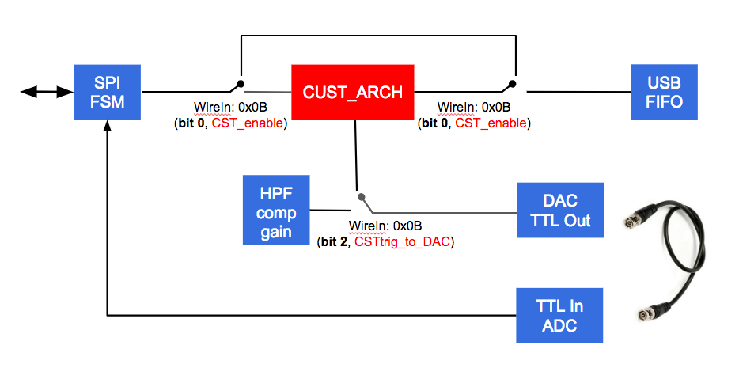

# Computation extensions for Intan RHS2000 #

## Table of Contents ##

* [Features](#Features "added computation features")  
* [Configuration](#Configuration "How to use the new features from the host computer")
* [Architecture](#Architecture "computation organization")
* [Remarks](#Development remarks "internal development discussions")

## FSM ##

There is currently no feature in the system. It is an empty box split from the main design. 

### Planned ###

* System wide filtering (High pass / low pass)
* System wide spike detection
* Realtime event outputs on the DACs
---  

## Configuration ##

Configuration for extra modules is independent from configuration of other INTAN features

### Description ###

The module requires one *PipeIn*, one *PipeOut*, one *WireIn* and one *WireOut* USB modules to communicate. High level instructions will be transfered through the *PipeIn* module whereas lowlevel configuration goes through the *WireIn*. The *PipeOut* module makes it possible to get configuration feedback from the *cust_arch*, and the *WireOut* module contains status data.

The following identifiers are used :
* PipeIn:  **0x88**
* PipeOut: **0xA1**
* WireIn:  **0x0B**
* WireOut: **0x27**

#### WireIn configuration bits ####

Bits  | Name           | Signification
----  | ----           | -------------
0     | CST_enable     | If 1, enables custom computation; if 0, provide the original behavior of INTAN design
1     | *reserved*     |
2     | CSTtrig_to_DAC | If 1, outputs trigger outputs to the DACs (*DAC_en* and *CST_enable* must also be set); if 0, DACs output provide the original behavior.
4-3   | *reserved*     |
15-5  | -              | available for new developments

#### WireOut configuration bits ####

Bits | Name           | Signification
---- | ----           | -------------
9-0  | FIFO_dat       | number of elements in the PipeOut FIFO
10   | ERR_input      | if set, *cust_arch* module did not receive data as expected. Some more elaborate command should give more details. Should be cleared by specific command.
10   | ERR_instr      | if set, *cust_arch* module did not understand a PipeIn command. Should be cleared by specific command.
15-12 | -             | No idea of what could be interesting to output

#### PipeIn / PipeOut instruction set ####

No instruction yet, because nothing to do :(

## Actual architecture

  
---  
 

## Architecture ##

### Interaction with INTAN architecture ###

All added computation is performed in the *cust_arch* module that is positioned between the main state machine that controls data flows and the FIFO that stores data waiting for USB transfer. Therefore, both data input and data output of *cust_arch* use the data stream format that is used by INTAN for USB transfers. the *cust_arch* module can also replace any data with results it computed itself.

### Computation module Architecture ###

There is no computation implemented in *cust_arch* today, there is no architecture available yet... :(

---
## Development remarks ##

YB: Project name, computing module name, and so, are not definitive, you can suggest any name you feel more appropriate to be affordable by the average enthousiast electrophysiologist.

### Feature requests ###

* [Filters](#Filters "precision on filter design")
* [Spike detection](#Spike detection "precision on spike detection")
* [Output events](#Output events "how and were should event triggers be output ?")

#### Filters ####

#### Spike Detection ####

#### Output Events ####

What is available now is to output the triggers on the ADCs. Events are binary data. Discussion is open to:
* output analog data
* directly stimulate through the stim channels of the intan chips
