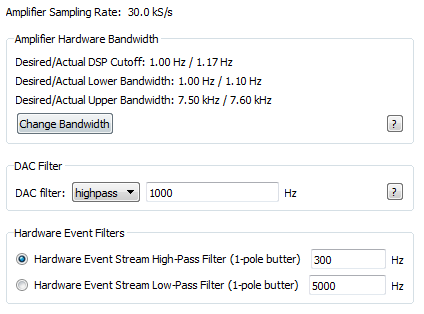
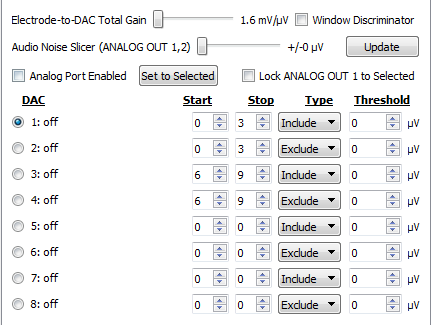
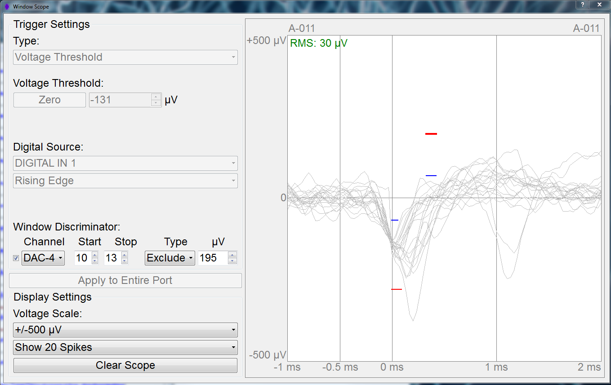
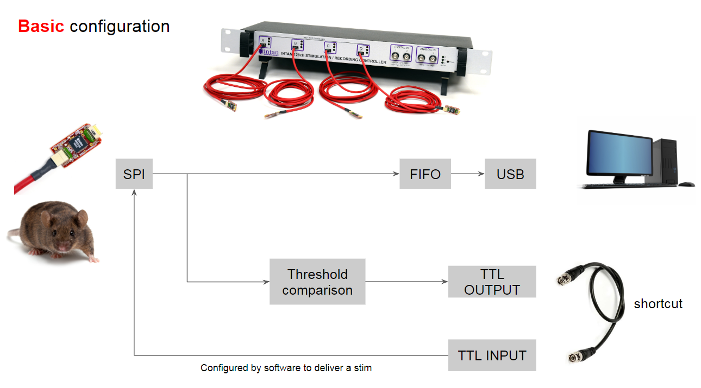
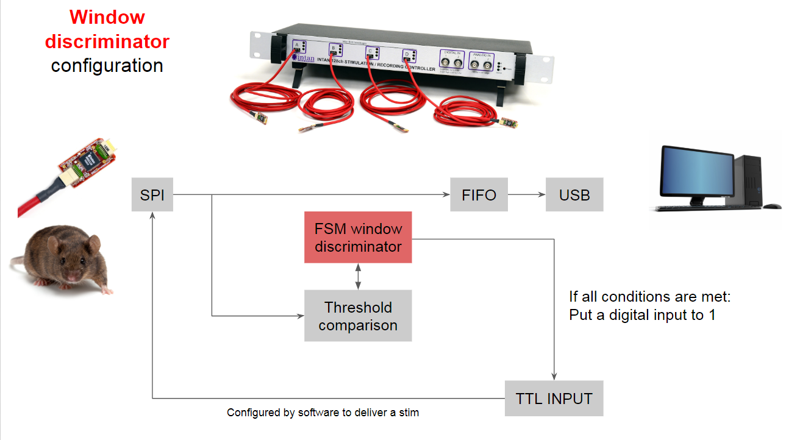
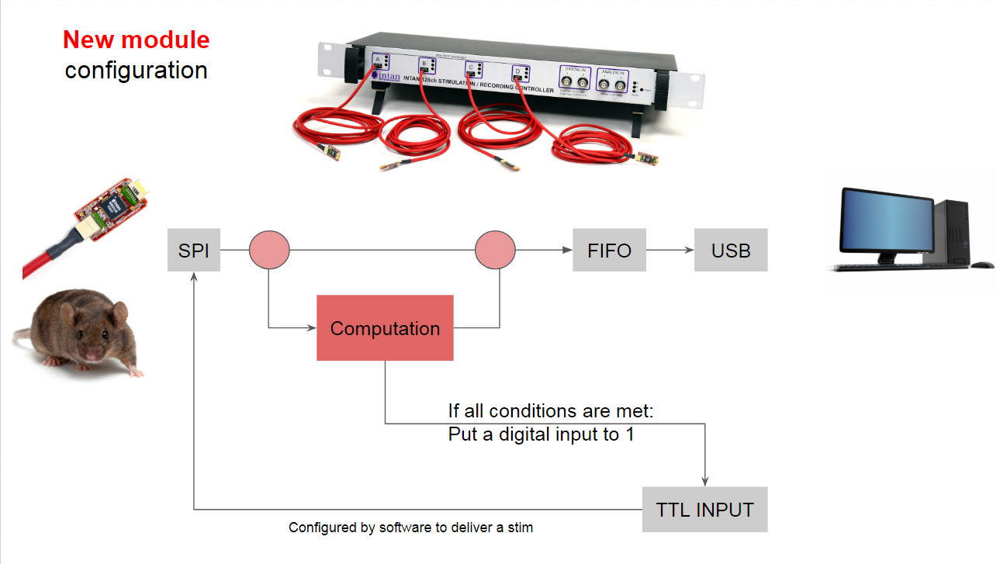

![][Logo_Small] 

# Intan Modifications #

This repository includes:  
* C++/Qt code for the modified RhythmStim [software interface](GUI) to the [OpalKelly XEM 6000 series FPGA](https://www.opalkelly.com/products/xem6010/ "Opal Kelly") used to run the serial parallel interface (SPI) to the [Intan](http://www.intantech.com/) analog-to-digital converter (ADC) integrated circuit.
* [Verilog code](Hardware) for modifying FPGA hardware communication and updates from the OpalKelly USB interface, as well as implementing new state machine and filtering logic for improved artifact rejection and use of LFP for adaptive neuromodulation.
* [Debugging](debugging) sub-folder with some Matlab/Simulink code and a little bit of sample data for characterizing performance and the new filter and state machine performance.
* A sub-folder with [documentation](doc) from [Intan](http://www.intantech.com/downloads.html  "Intan Downloads") for convenience.

## Table of Contents ##

* [Motivation](#motivation)  
* [Goals](#goals)  
* [Examples](#examples)
	* [Filters](#filter-updates)
	* [Window Discriminator](#window-discriminator)
	* [FPGA Signal Routing](#fpga-signal-routing)
* [Significance](#significance)

### Motivation ###

This was all started by trying to create a better method to conduct real-time, neural-activity-dependent stimulation.
Because the stimulus artifact causes saturation of the hardware amplifiers, often a simple thresholding method
is insufficient for the detection of events of interest in neurophysiological recordings (such as spikes). 
A finite state machine (FSM), similar to the one detailed in [Azin, Guggenmos et. al. (2011)](https://ieeexplore.ieee.org/document/5723023/ "A Battery-Powered Activity-Dependent Intracortical Microstimulation IC for Brain-Machine-Brain Interface"),
was rudimentarily implemented in the existing FPGA interface to the Intan amplifier chips, by cobbling together
a modified set of threshold detectors from the existing DAC threshold detection machinery provided in the original
Intan Stimulation Controller FPGA interface. 

It has so far been determined that this FSM outperforms pure threshold detection (in terms of rejecting false-positive
spiking events), and does not have a significant overall degradation on the performance of the Intan stimulation system.

Therefore, the current status is in modularizing this new FSM which will be used for detecting neural events of interest,
as well as in simplifying the main SPI FSM code. 

The currently most-pressing concern is to de-couple the FSM from the existing DAC machinery, and isolate it as its own
module within the Verilog code. This will allow (in conjunction with modifications to the software UI), the simultaneous
activation of multiple independent "neural event" discriminators- both in highpass filtered data and lowpass filtered data.

### Goals ###

Current goals for GUI modifications **(Updated June 15, 2018)**:

1. ~~Create a new spike scope window to visualize a new spike detection method (similar to the one detailed in [Azin, Guggenmos et. al. (2011)](https://ieeexplore.ieee.org/document/5723023/ "A Battery-Powered Activity-Dependent Intracortical Microstimulation IC for Brain-Machine-Brain Interface");~~ **complete**  
2. Create a [new tab](../GUI/MM-RHS2000_Interface/source/mainwindow.cpp "link to C++ code") for event detection (e.g. spike count, rasterplots, PSTH); - partially complete  
3. ~~Create an option to detect Local Field Potentials (LFPs);~~ **completed during May 2018 MAECI collaboration at IIT**  
4. ~~Add the possibility to replay the amplifier activity instead of the generation of synthetic neural data for demonstration purposes if no Controller or Evaluation board is connected.~~ **completed during May 2018 MAECI collaboration at IIT**  
5. Complete "Event Streams" tab module (relates to Goal 2);  
6. Break mainwindow.cpp into many smaller code files and functions to make it easier to work with. Also, remove hard-coded indexing values such as DAC_Threshold1, etc.  

Current goals for Verilog/Hardware modifications **(Updated June 15, 2018)**:

1. Improve ~~and debug~~ the state machine code to make it more easily understandable. **debug completed during May 2018 MAECI collaboration at IIT**  
2. Modify the [filtering module](../Hardware/MM-FSM/2018-01-16_RHS2000%20Window%20Discriminator/scalable_filter.v ("link to verilog code")) to make it easier to expand and add more data streams. - partially complete  
3. Verify that the twos complement implementation of Low Pass Filter is working properly in the hardware filter.  

### Examples ###

Examples of substantial modifications

#### Filter Updates ####
  
_**Figure 1:** New filter configuration tab layout and capabilities. A major addition with this combination of modified GUI and modified main.bit hardware configuration file is the ability to switch between a highpass and lowpass filter on the DAC, so that slow events (for example, amplitude of particular LFP rhythms of interest) could be used in conjunction with a state machine discriminator to trigger stimulation for neuromodulation. Previously, this was possible by changing the bandwidth settings on the amplifier; however, this would prevent the simultaneous acquisition of fullband signals, so that information of interest in high frequency bands such as multi-unit activity (approx. 300-5000 Hz) would be lost. The Hardware Event Filters at the bottom currently don't do anything since they are not connected to any output signal from the FPGA. However, the goal is that most filtering and detection functionality that is currently implemented through the DAC will be moved to these streams, which can be expanded to take advantage of unused resources on the FPGA._

---

#### Window Discriminator ####
  
_**Figure 2:** New DAC tab layout and capabilities. In order to add the ability to reject waveforms that cross a single amplitude threshold, but are too large in amplitude (for example, due to chewing artifact or stimulation artifact), multiple threshold levels in combination must be incorporated into a state machine that determines whether stimulation should be delivered. For convenience, preliminary development of such a "window discriminator" module was made by modifying the existing DAC tab, since data streams were already passed through a hardware highpass filter there. A similar mechanism will be implemented for the hardware event streams indicated by the bottom panel of Fig. 1._

  
_**Figure 3:** New Spike Scope. By enabling the Window Disciminator checkbox in the main interface, the Spike Scope changes to allow online setting of window levels and onset/durations. In this example, spikes are greyed because they have passed the initial state conditions of the first blue and red line, but fail to meet the amplitude levels required by the third and fourth criteria. Blue indicates an inclusion criterion, which means that the monopolar threshold set by that level must be high for the duration of the level. Similarly, red is an exclusion criterion, indicating that the monopolar threshold set by that level must remain low for the duration of the level. Waveforms that pass through all specified levels and durations trigger a high impulse for a single sample on Digital Input 13, which can be used to trigger stimulation._

---

#### FPGA Signal Routing ####

  
_**Figure 4:** Activity Dependent Stimulation (ADS) using the Intan Stimulation Controller with no modifications to FPGA hardware or software. A monopolar threshold is set on a single DAC channel that is determined to contain adequate neural spiking activity. A BNC cable hooks the digital TTL output corresponding to thresholded output from that DAC channel to a digital TTL input. The TTL digital input channel is then set to trigger stimulation on the rising edge of the digital trigger with a fixed delay and blanking period after the stimulus delivery._

  
_**Figure 5:** ADS using the Intan Stimulation Controller with window discriminator option added to DAC via FPGA hardware and software interface modifications. For a single channel, multiple monopolar thresholds (up to 8) are set as "inclusion" or "exclusion" criteria for a state machine, for which all conditions must be true for the duration of each monopolar threshold level (e.g. a given threshold can be set to be maintained for the first two samples after a spike of sufficient amplitude is detected). All circuits are connected internally. Because the state machine runs through the DAC, multiple channels cannot trigger stimulation independently because the state machine "complete" output is routed to apparent "Digital Input 13" (because the lab didn't purchase the digital I/O expander and therefore didn't need that input). Stimulation is triggered at a fixed latency after Digital Input 13 achieves a high state, and a fixed blanking period during which Digital Input 13 cannot trigger stimulation is imposed._

  
_**Figure 6:** Intan modifications designed to implement architecture more similar to a classical engineering control system. A computational module is implemented between the SPI and FIFO buffer, which does not necessarily need to involve the DAC in any way. Possible computations could include implementing [filters](#filter-updates), [state machines](#window-discriminator), or some sort of feedback control that depends on activity detected on many channels simultaneously._

---

### Significance ###

The end-goal is to make a user interface which can easily be reconfigured to work with a greater number of data streams, and with different combinations of online functionality.

Closed-loop neuromodulation strategies have, in recent years (as of writing this in 2018), become a widespread approach for a variety of neurorehabilitation and therapeutic strategies. It is important to not only be able to use event-detection algorithms, in near-real-time, for spiking events, but also for broader population measures such as the LFP (which is in the low-frequency component of the extracellular field data). It is not inconceivable that the combination of detected LFP events as well as detected spiking events could prove useful as a biomarker of critical periods for introducing stimulation to the system. Therefore, the improvements to the existing Intan interface architecture provided by this collaboration will hopefully be of use to others such as ourselves, who endeavor to improve the field of adaptive neuromodulation through technological advancement.

[Logo_Small]: https://github.com/StefanoBuccelli/intan_project/blob/KUMC/doc/Images/Logo_Small.png "Intan Modifications"

