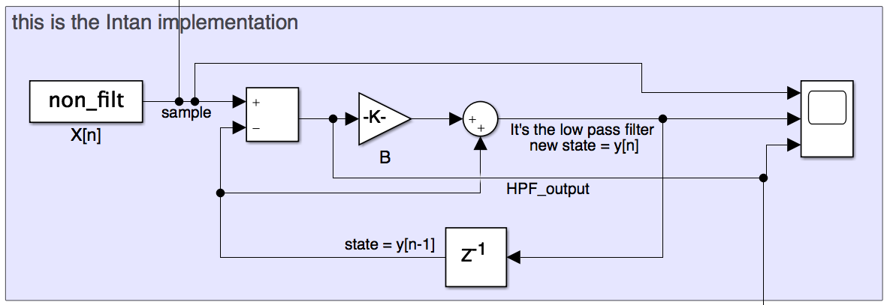

# Understanding filters
The one pole high-pass filter implemented in DAC_output_scalble_HPF:

  

the idea is to use the LFP instead of the HP filtered data. The low-pass is computed in any case and it's called new_state in the verilog code.
